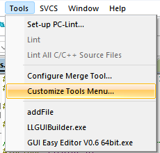
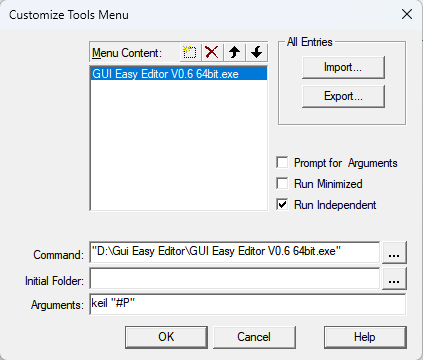
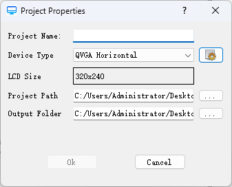
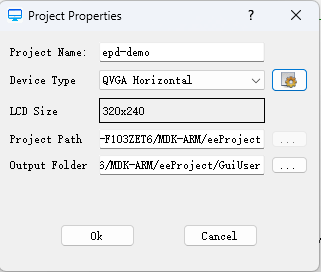

# 上位机使用

## 快捷启动的配置
### Keil
默认情况下，会自动对keil配置快捷启动按键。

在keil顶部tools菜单中找到Gui Easy Editor，如果找不到，可以尝试以下方式。
#### 自动安装
Gui Easy Editor安装目录下找到install.bat文件，运行该文件。
#### 手动安装
1. 打开keil，Tools菜单 -> Customize Tools Menu... 。

    
2. 点击Menu Content旁边的虚线方框，新建菜单。
3. 名称输入Gui Easy Editor。
4. Command选择Gui Easy Editor.exe文件,并使用双引号包住文件路径(解决路径有空格导致出错的问题)。
5. Arguments输入keil "#P"
6. 勾选Run Independent。

    

### Segger Embded Studio
默认情况下，会自动对ses配置快捷启动按键。

## 手动启动Gui Easy Editor
1. 直接运行Gui Easy Editor.exe文件。
2. 点击New Project，新建项目。

    
3. 使用英文输入项目名称。
4. 选择屏幕尺寸，如果不适合点击旁边的配置按键，自行添加屏幕尺寸。
5. 配置项目目录和文件输出目录。
6. 如果项目名称或路径不符合要求，会有红字提示。

## 在Keil中启动Gui Easy Editor
1. 打开Keil项目，点击Tools菜单 -> Gui Easy Editor。
2. easyEditor会自动识别Keil项目路径，并自动新建ui项目。

    
3. 项目名称自动生成，无法修改。
3. 选择屏幕尺寸，如果不适合点击旁边的配置按键，自行添加屏幕尺寸。
4. 项目路径自动生成，无法修改。
5. 文件输出目录可按实际需求修改。
6. 点击Ok，Gui Easy Editor会自动启动。
7. 如果项目路径或文件输出目录不符合要求，会有红字提示。

