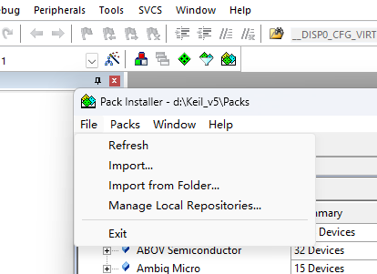
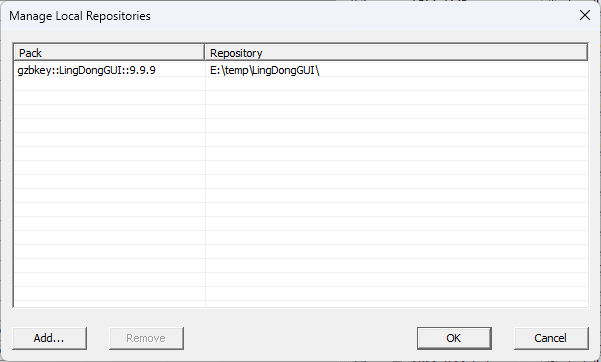
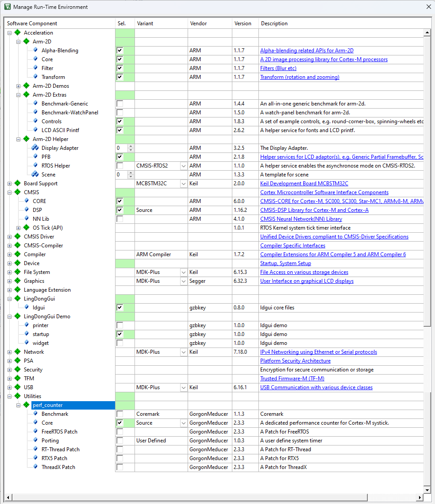
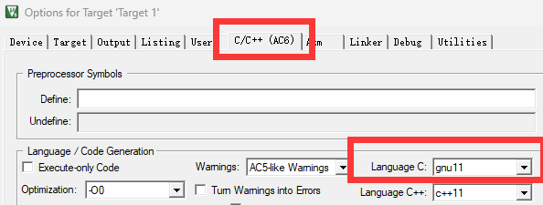
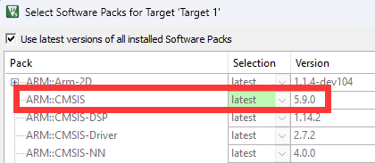
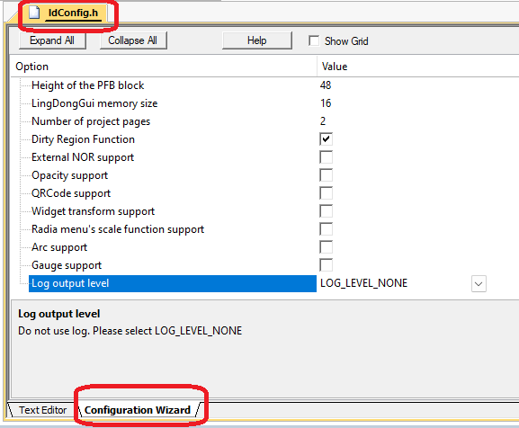
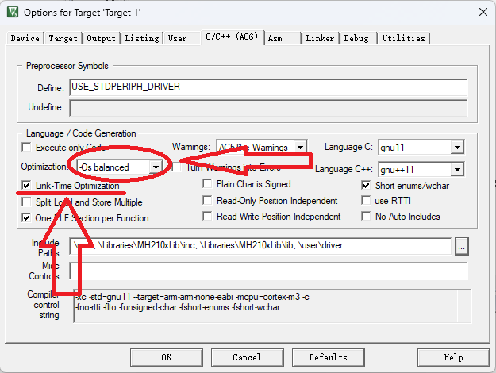

# 移植

本文档以单片机为标准，说明移植过程

## 基于Keil的移植

安装好MDK-ARM，这里使用的版本是5.39。建议使用最新版本

#### 移植前的准备

cmsis-5 和 cmsis-6 二选一

* 安装cmsis-5
    * [下载](https://github.com/ARM-software/CMSIS_5/releases/)
* 安装cmsis-6 + Cortex DFP
    * [下载](https://github.com/ARM-software/CMSIS_6/releases/)
    * [下载](https://github.com/ARM-software/Cortex_DFP/releases/)
* 安装cmsis-dsp
    * [下载](https://github.com/ARM-software/CMSIS-DSP/releases/)
* 安装arm-2d的pack
    * [下载](https://github.com/ARM-software/Arm-2D/releases/)
* 安装perf_counter的pack
    * [下载](https://github.com/GorgonMeducer/perf_counter/releases/)
* 安装ldgui的pack
    * [github下载](https://github.com/gzbkey/LingDongGUI/releases/)
    * [gitee下载](https://gitee.com/gzbkey/LingDongGUI/releases/)
* 安装python,安装时注意勾选添加到系统环境变量的选项
    * [下载](https://www.python.org/downloads/)
* 准备带屏幕的开发板，可以正常显示图片的keil项目(lcd_project)
* 屏幕接口
    ```c 
    void Disp0_DrawBitmap (uint32_t x, 
                           uint32_t y, 
                           uint32_t width, 
                           uint32_t height, 
                           const uint8_t *bitmap)
    ```
* ldgui源码地址

    🏠️主仓库: https://gitee.com/gzbkey/LingDongGUI

    🏠️镜像仓库: https://github.com/gzbkey/LingDongGUI

* cmsis相关pack亦可在arm官方下载地址 https://www.keil.arm.com/packs/

#### git方式下载ldgui
```
//gitee
git clone --recursive https://gitee.com/gzbkey/LingDongGUI.git
```
```
//github
git clone --recursive https://github.com/gzbkey/LingDongGUI.git
```

|ℹ️ 关于github下载慢的问题|
|:----|
|推荐使用Watt Toolkit加速|

#### 注意事项
1. 使用cmsis-6，出现error: no member named 'IP' in 'NVIC_Type'
    在keil的option选项，C/C++页面，Define项，加入宏定义IP=IPR(如有其他定义，注意使用英文逗号隔开)

#### 使用源码安装pack(推荐)
1. 没有最新pack的情况下，git方式下载源码

2. pack install配置界面中，选择manage local repositories(建议使用MDK-ARM最新版本，部分版本用此方法安装无效)

    

3. 加入源码中的.pdsc文件

    

#### 配置keil pack

1. 在lcd_project中加入arm-2d、perf_counter、DSP、CMSIS、ldgui
    keil中选择Project -> Manage -> Run-Time Environment

    

2. 选择ac6编译器，并且选择gnu11，警告选择ac5-like

    

3. 如果使用ac5编译器，则需要选择c99和gnu支持(不建议使用ac5)

    

4. 确保keil的CMSIS版本不得低于5.7.0，查看方式，Project -> Manage -> Select Software Packs

    

5. ldConfig配置 (**重要**)
    * ldConfig.c中的ldCfgTouchGetPoint函数是触摸接口，需要根据用户实际触摸驱动进行对接
    * ldConfig.h可以使用keil的图形界面方式进行配置
    * 如果不使用打印功能，请务必将USE_LOG_LEVEL配置为LOG_LEVEL_NONE
    * 补全ldConfig.c中的函数Disp0_DrawBitmap

        

## 基于RISCV的移植

#### 移植前的准备
1. 下载ldgui的源码(包含ARM-2D源码)
2. 准备系统定时器，当前riscv提供了一个52位计时器

#### 移植过程
1. 添加ldgui到工程中，并新建用户文件夹user。
2. 复制src/porting中的文件复制到user文件夹中。(ldConfig.c、ldConfig.h、arm_2d_disp_adapter_0.c、arm_2d_disp_adapter_0.h、arm_2d_user_arch_port.h、arm_2d_cfg.h)
3. 添加examples/common/Arm-2D到项目中。
4. 添加examples/common/math到项目中。
5. 设定全局define，ARM_SECTION(x)= ,__va_list=va_list,RTE_Acceleration_Arm_2D_Helper_Disp_Adapter0
6. 设定编译器参数，-std=gnu11 -MMD -g -ffunction-sections -fdata-sections -fno-ms-extensions -Wno-macro-redefined -Ofast -flto
7. 修改arm_2d_user_arch_port.h，参照该文件arm内核的代码，补充完整或加入对应的头文件。
8. 修改ldConfig.c
    * arm_2d_helper_get_system_timestamp,获取系统tick
    * arm_2d_helper_get_reference_clock_frequency,获取芯片主频

## 代码测试

1. 测试arm-2d的demo

    将ldConfig.h中的 DISP0_CFG_DISABLE_DEFAULT_SCENE 设置为0

    main.c中加入代码

    ```c 
    #include "arm_2d.h"
    #include "arm_2d_disp_adapters.h"
    #include "perf_counter.h"

    __attribute__((used))
    void SysTick_Handler(void)
    {
    }

    int main(void) 
    {
        system_init();     // 包括 LCD 在内的系统初始化

        //仅在keil中初始化perfectCounter
        //init_cycle_counter(false);

        arm_irq_safe
        {
            arm_2d_init(); // 初始化 arm-2d
        }

        disp_adapter0_init();
        while(1)
        {
            disp_adapter0_task();
        }
    }
    ```

2. 运行效果

    

|ℹ️ keil出现Undefined symbol错误，请勿勾选microLib|
|:----|
|如果硬要勾选microLib，编译后，提示找不到__aeabi_h2f 、__aeabi_f2h，请升级编译器(安装新版本keil)|

3. 进入目录src/template，运行脚本uiPageCreate.py，输入需要生成的页面名称。如果需要同时生成多个页面，反复运输入多个页面名称。
4. 运行uiPageCreate.py后，会自动生成uiPageOutput文件夹，复制里边的文件到项目中。
5. 将文件导入项目中，main.c中添加页面文件的头文件
6. 在main函数中使用ldGuiInit，设置启动页面
    ~~~c
    #include "uiHome.h"

    int main(void)
    {
        sysInit();

        arm_irq_safe {
            arm_2d_init();
        }

        disp_adapter0_init();
        
        ldGuiInit(&uiHomeFunc);

        while(1)
        {
            disp_adapter0_task();
        }
    }
    ~~~

## 其他说明
### 使用外部NOR
1. ldConfig.h中USE_VIRTUAL_RESOURCE = 1
2. ldConfig.c中__disp_adapter0_vres_read_memory添加读取nor的函数

### 关于程序体积

* 请注意修改编译器的优化等级

    

* gcc编译器也有对应的选项，或直接使用命令选项，如上述命令中出现的-Ofast -flto